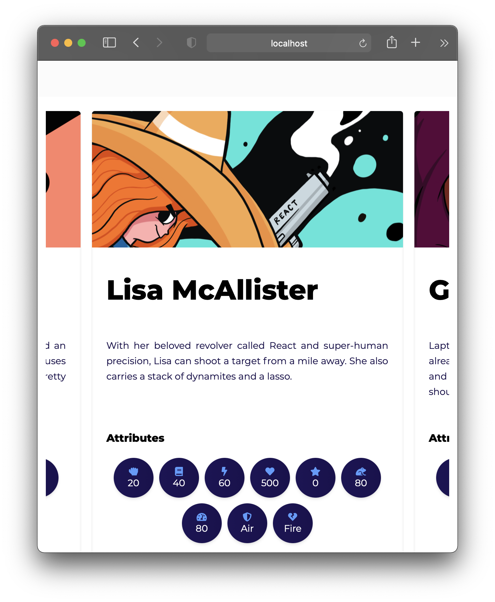

# Home assignment

### Backend

Completing the assignment proved to be a real learning experience for sure.
Although I have worked a bit with GraphQL in the past, I had never used this kind of comprehensive stack before, and there most likely are some, not the wisest practices used on this solution.

After battling with library documentations for a while I indeed arrived at a working solution.

Through the power of arbitrary nomination the hero Gideon has been granted the role of a `TreasureKeeper` that can access the vault. And for good merit, all the other heroes have received a `hero` role as well.

So authenticating with user id 3 grants a JWT that can be used to unlock the vault.

### Frontend

Even though my main focus was on the Backend, I thought that I would like to try what the frontend assignment would have going for it.

Using the `styled-components` I created a quick and simple 'overflowing' card view.



## Original notes

For this assignment we have created a GraphQL API and a simple React application that queries infromation from that API. It is your job to finalize this application, either from frontend or backend side. More information of these tracks down below in Tracks section.

The application itself is built to be an "Index" of Heroes. These Heroes works as mercenaries and can be summoned to help fight supervillains. In the Frontend Track your task is to built visuals for the Index. In the Backend track your job is to secure access to Heroes Vault, where they keep their treasures.

This assignment assumes that you are comfortable with node.js projects, have some experience with React and have either knowledge of backend or frontend technologies.

The application consists of two addresses: localhost:8080, which serves the frontend and localhost:4000, which is the address for GraphQL endpoint and playground. You can find the scripts to start these from below. You need to have both back and frontend running for the whole application to work.

You only need to do the track you applied to, but you can also do both if you want to.

Happy hunting!

# Good to know

Application is written in Typescript.

Frontend: Using React-Hooks, styling done with Styled Components

Backend: Database layer / persistance layer is done with Typeorm, GraphQL Schema and resolvers are implemented with TypeGraphQL

## Tracks

### Frontend

We have provided frontend with information about our Heroes. You can find the query that gets the data from `src/app/views/HeroIndex/index.tsx` file.

We have NOT created HeroCard (`src/app/components/HeroCard/index.tsx`). It is your job to design and implement visuals for this component. You can also extend visuals around HeroIndex and other areas of the application.

You can decide what of the data you use, if you want to open those cards to modals or/and have them there. The stage is really yours.

Those two files mentioned above will be where your main focus should be, but you can also change anything you want if you wish to.

This tracks point is to test your React + CSS + Typescript skills and visual "eye".

### Backend

Our Hero Vault is wide open for everyone. We need to secure it!

For this track your job is to implement an ACL (Access Control List) for our GraphQL layer. This can be done for example using certain roles within our Hero -entity and that the heroes have the correct role before trying to access given resource.

We have provided fake authentication GraphQL Node into our API which can be queried with following GQL query

```
query {
	authenticate(userId:"1") {
    jwt
  }
}
```

Your job is to:

- Implement hero roles, and seed the heroes with roles
- Secure the vault.treasures resource behind a specific role
- Fetch the JWT token for a hero with access, and use it to get the treasures via GQL

Tip: once you have fetched the JWT token for a hero, you can set it as a HTTP HEADER for the Graphql request like so: `{"Authorization": "<TOKEN>"}`

For entry points in codebase, look into `src/server/services/auth-service.ts`, `src/server/resolvers/auth-resolver.ts`,`src/server/entities/vault.ts` and server configurations can be found in `src/server/index.ts`

Vault can be queried with following GQL query

```
query {
	vault {
    treasures
  }
}
```

For more information about authorization in TypeGraphQL see https://github.com/MichalLytek/type-graphql/blob/master/docs/authorization.md

This tracks point is to test your debugging skills and skill gaining more knowledge from documentation, as well as understanding project structure and learning Typescript & GraphQL. There are lots of correct ways to complete this excersize!

## What we expect

We really want you to have fun and learn something while doing this.

After you've returned your implementation, we'll have a discussion with you where we go through your code together. Also think how you would improve your implementation or the application.

## What we don't expect

We don't want you to spend countless hours struggling with one minor detail. If you hit a wall, try to implement something else.

## Returning the assignment

Return the assigment as a link to a repository on Github. If you want to keep your assignment private, you can compress your git repository and send it as an email attachment.

## Scripts

Use yarn instead of npm, there is some bug with npm and Docz.

Install dependencies: `yarn`

Develop frontend app: `yarn start:front` localhost:8080

Develop backend app: `yarn start:back` localhost:4000

### Docz

OPTIONAL
Develop front end components on simple encapsulated environment: `yarn docz:dev` localhost:9001
